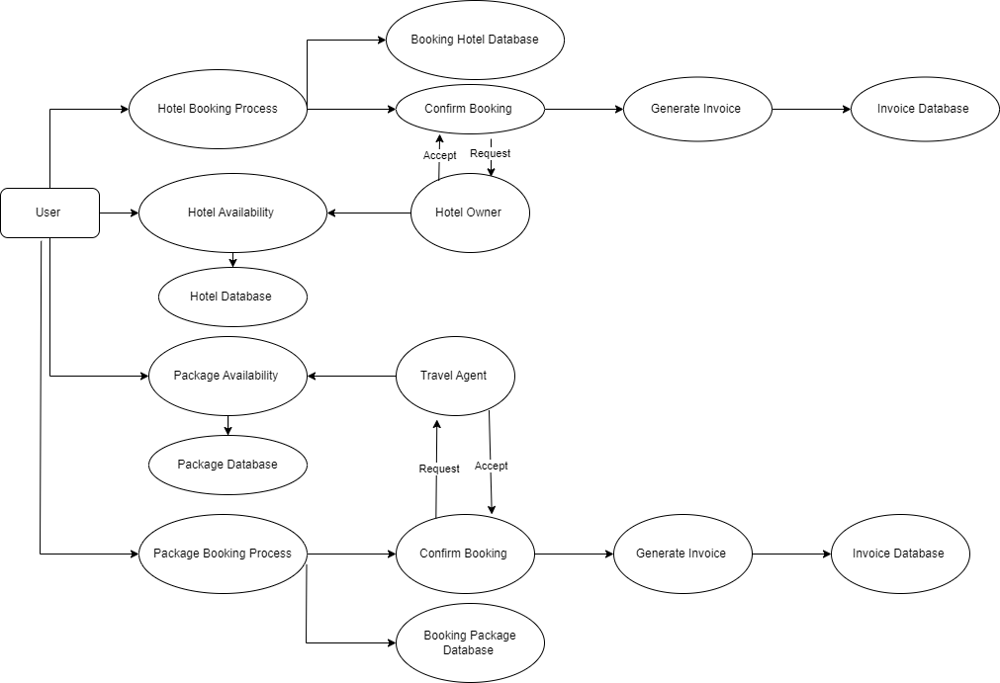
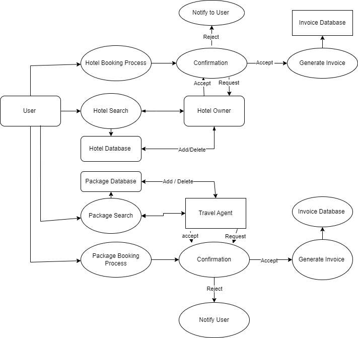
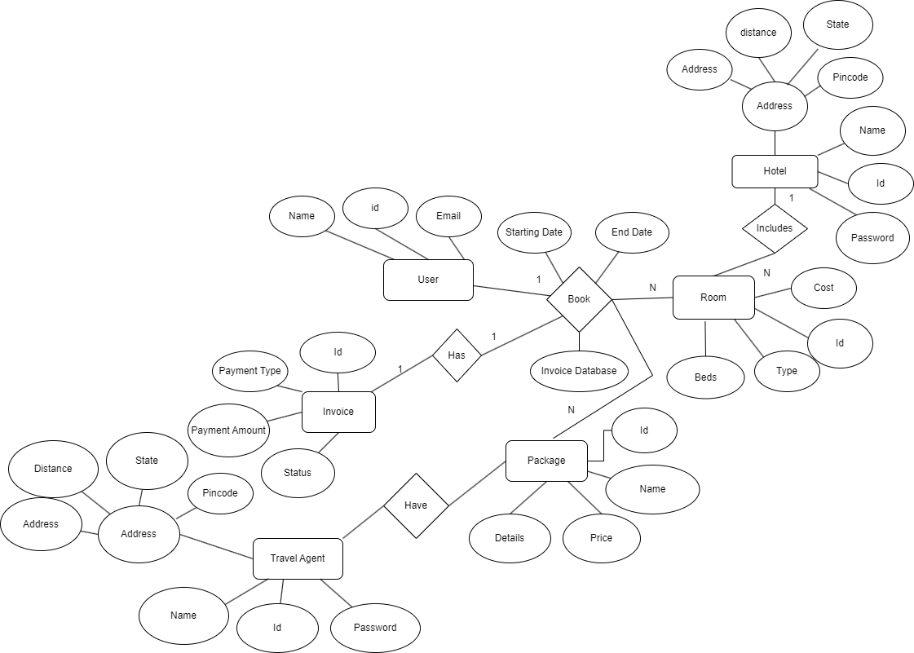
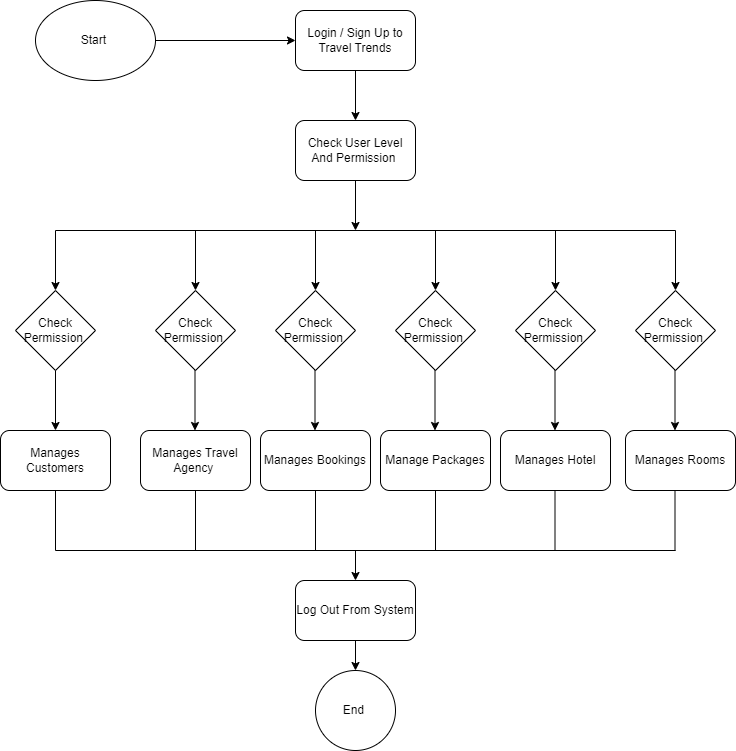

# Travel Trends

Travel Trends is a comprehensive travel management application developed using Kotlin and Firebase. It caters to multiple user types including Customers, Hotel Owners, Travel Agencies, and Administrators, providing a platform for hotel bookings and travel package management.

## Features

### For Customers
- User authentication and login
- Hotel search functionality
- Hotel room booking
- Travel package booking
- Booking history view

### For Hotel Owners
- Room management (add, update details)
- Booking record management

### For Travel Agencies
- Travel package management (add, update details)
- Booking record management

### For Administrators
- User account management
- System log monitoring
- Issue resolution and complaint handling

## Technology Stack
- **Frontend**: Kotlin
- **Backend**: Firebase

## Installation
1. Clone the repository
2. Open the project in Android Studio
3. Set up Firebase project and add the `google-services.json` file to the app module
4. Build and run the application on an emulator or physical device

## Usage
After installation, users can:
1. Log in or register for an account
2. Browse hotels or travel packages based on their preferences
3. Make bookings for hotel rooms or travel packages
4. View their booking history

Hotel owners and travel agencies can manage their listings and view booking records.

Administrators have access to user management tools and system monitoring features.

## Development
This project is developed using Kotlin and Firebase, demonstrating the following:
- Kotlin programming for Android development
- Firebase Authentication for user management
- Firebase Realtime Database for data storage and retrieval
- Firebase Cloud Functions for server-side logic (if applicable)

## Future Enhancements
- Implement real-time chat support for customer service
- Add a review and rating system for hotels and travel packages
- Integrate payment gateway for online transactions
- Develop a recommendation system based on user preferences and booking history

## Contributing
We welcome contributions to improve Travel Trends. Please feel free to fork the repository, make changes, and submit a pull request.

## License
This project is licensed under the [MIT License](LICENSE).

## Diagrams

